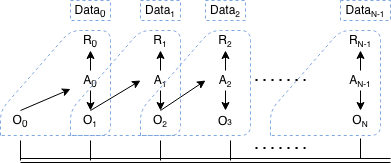

# Hedging Market Reward Rules

## Environment Loop

In `Environment` **⬄** `Actor` loop, it starts with a state observation  generated by `Environment` and observed by `Actor`. Then `Actor` selects an action  by taking  into consideration. After `Environment` receives the action, it generates a reward  to action  and the next step state observation . In the meantime, the environment discount  ensuing from action  is also generated by `Environment`. This discount is applied to future rewards after .  The cycle continues until it reaches the last state observation  in the terminal state of episode.

## Transition Tuple

For each step, denote a transition tuple . This tuple is a unit of data that is inserted into the replay buffer for `Learner`.

The following diagram demonstrates the `Environment` **⬄** `Actor` interaction and the transition tuple per actor step:

### Transition Data Diagram

---

## Hedging Market Reward

There are two alternative formulations of the hedger's problem: the accounting P&L formulation and the cash flow formulation. We focus on the P&L formulation in our implementation.

### Accounting P&L formulation

In the accounting P&L formulation, there are three components contributing to P&L:

- P&L contributed from option position
- P&L contributed from hedging position (underlying)
- P&L contributed from trading cost for portfolio rebalance

Let's denote  as the holding of hedging position between time  to ;  as the underlying price at time .

Considering a hedging action , which is the buy/sell shares at time at time . its effect includes:

1. The hedging position change from  to . It causes a trading cost . Simply formulate  as a proportion of the traded value .

2. The portfolio (option + hedging) P&L incurred between  and .

By combining the two parts together, we can formulate the reward  for  as:

when . Here  is the terminal state (see [Diagram](#Transition-Data-Diagram)).

For :

The terminal state  happens at the option expiry time. The term  is the trading cost of liquidating the hedging position at last.
